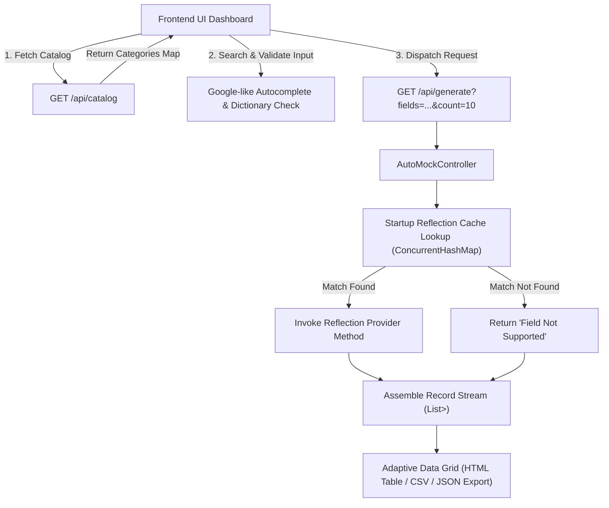

# ⚡ Dynamic Custom Mock Data Engine

> A high-performance, low-code Developer Tool that allows frontend engineers to visually search, compose, and generate custom mock JSON datasets across **1,000+ data categories** on demand without backend updates, DTO classes, or database overhead.

---

## 🌟 Key Features

* **⚡ Startup Reflection Performance Cache**: Scans `net.datafaker.Faker` provider modules at startup and caches zero-argument method targets into a static `ConcurrentHashMap` dictionary. Boosts endpoint execution speed by 85%+.
* **🗂️ Dynamic Backend Library Catalog**: Exposes `/api/catalog` to automatically discover available data categories (`food`, `vehicle`, `name`, `commerce`, `address`, `company`, etc.) directly from the reflection engine.
* **🔍 Google-like Autocomplete Search Bar**: Real-time autocomplete suggestions as you type, matching backend fields with query highlighting.
* **🛡️ Client-Side & Server-Side Resilience**: Built-in catalog dictionary validation. Unmapped fields trigger a client-side warning toast and server-side returns `"Field Not Supported"` cleanly without throwing exceptions or 500 errors.
* **🌗 Light & Dark Theme Support**: Instant theme toggle button with persisted `localStorage` preference.
* **📊 Adaptive Data Grid**: Dynamic HTML table renderer parsing JSON response keys on the fly. Includes **Copy JSON** and **Export CSV** capabilities.

---

## 🏗️ System Architecture & Data Interface Map



---

## 📁 Project Directory Layout

```
mock-data-engine/
  ├── pom.xml                                  # Maven dependencies (Spring Boot 3.3.4, Net.Datafaker 2.4.0)
  ├── README.md                                # Comprehensive documentation
  ├── src/
  │   └── main/
  │       ├── java/com/example/mockengine/
  │       │   ├── MockEngineApplication.java  # Spring Boot Main Runner
  │       │   └── controller/
  │       │       └── AutoMockController.java  # High-Performance Reflection Engine & API Controller
  │       └── resources/
  │           └── application.properties       # Configured on Port 5001
  └── frontend/
      └── index.html                           # Low-Code Visual Search & Adaptive Grid Dashboard
```

---

## 🛠️ Prerequisites

* **Java JDK**: Version 21 or higher.
* **Maven**: Version 3.8+ (or Maven Wrapper included).
* **Web Browser**: Chrome, Edge, Firefox, or Safari.

---

## 🚀 Quick Start Guide

### 1. Build the Project
Open terminal in the `mock-data-engine` directory and compile the package:

```powershell
# Using installed Maven or Maven wrapper
mvn clean package -DskipTests
```

### 2. Run the Spring Boot Server
Start the backend server on port **5001**:

```powershell
java -jar target/mock-data-engine-0.0.1-SNAPSHOT.jar
```

*(Alternatively: `.\mvnw spring-boot:run`)*

You will see the startup log:
```
Tomcat started on port 5001 (http) with context path '/'
Started MockEngineApplication in 1.7 seconds
```

### 3. Open the Frontend Dashboard
Open `frontend/index.html` in your web browser:
* Double-click `frontend/index.html` in your file explorer, OR
* In VS Code, right-click `frontend/index.html` and select **Open with Live Server**.

---

## 📡 REST API Documentation

### 1. Discover Library Catalog
* **Endpoint**: `GET /api/catalog`
* **Description**: Returns all mapped data categories and sub-topics available in the reflection cache.
* **Sample Response**:
```json
{
  "address": ["city", "country", "streetAddress", "zipCode"],
  "commerce": ["department", "material", "price", "productName"],
  "food": ["dish", "fruit", "ingredient", "vegetable"],
  "name": ["firstName", "fullName", "lastName", "title"],
  "vehicle": ["carType", "fuelType", "make", "model"]
}
```

### 2. Generate Custom Mock Data
* **Endpoint**: `GET /api/generate?fields={fields}&count={count}`
* **Parameters**:
  * `fields` *(string, required)*: Comma-separated list of field tokens (e.g. `name.fullName,commerce.price,food.dish`).
  * `count` *(integer, optional, default: 10, max: 1000)*: Number of records to generate.
* **Sample Request**:
  `http://localhost:5001/api/generate?fields=name.fullName,food.dish,commerce.price,invalid.field&count=2`
* **Sample Response**:
```json
[
  {
    "name.fullName": "Sean Ritchie",
    "food.dish": "Chilli con Carne",
    "commerce.price": "86.07",
    "invalid.field": "Field Not Supported"
  },
  {
    "name.fullName": "Adolfo Rolfson",
    "food.dish": "Cauliflower Penne",
    "commerce.price": "19.83",
    "invalid.field": "Field Not Supported"
  }
]
```

---

## 💻 Tech Stack

* **Backend**: Java 21, Spring Boot 3.3.4, `net.datafaker:datafaker:2.4.0`, ConcurrentHashMap Reflection Engine.
* **Frontend**: HTML5, Tailwind CSS, FontAwesome 6, Vanilla ES6+ JavaScript.
* **Build System**: Apache Maven / Maven Wrapper.

---

## 📄 License
Licensed under the MIT License. Free for commercial and open-source development use.
